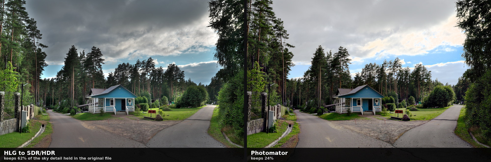
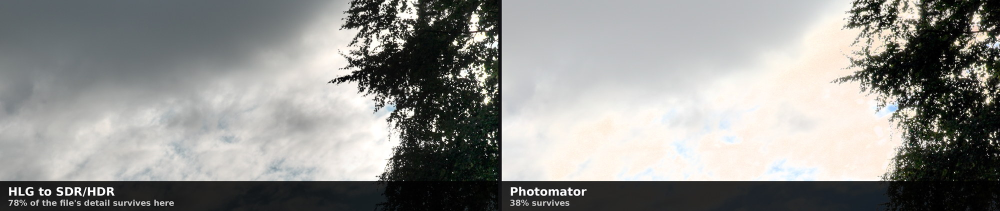
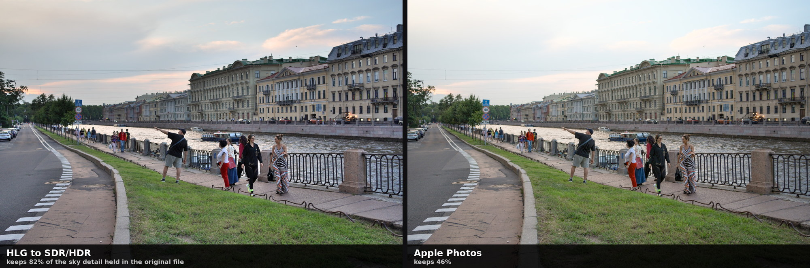
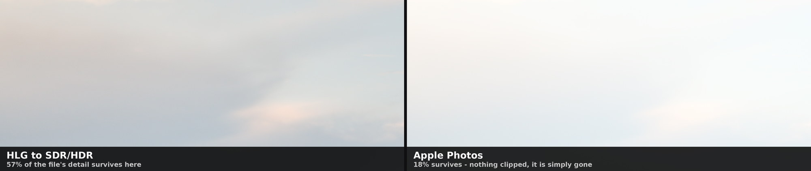

# HLG to SDR/HDR

A small macOS app that converts HLG HEIF photos — the HDR stills Sony cameras write as
`.HIF` — into ordinary SDR images without burning the highlights out, and into HDR images
that modern displays can show in full.

**[Download the latest release](../../releases/latest)** · free · macOS 15 or later

## Why

A Sony HLG HEIF holds two to three stops more highlight than a JPEG, 10-bit gradients and a
wide colour gamut. What it does not hold is any instruction for folding that range down to
an ordinary screen — Sony leaves it out, and no standard fills the gap. So every program
guesses differently, and the guesses show up in the sky: bright areas run into flat white
and take the cloud texture with them.

This app makes that fold explicit and leaves the decision to you.

## What the fold costs

Both versions below were adjusted by hand — each program given its best shot rather than
its default. The reference is the original `.HIF` itself, so the question is not whose
taste you prefer: it is how much of the detail actually recorded in the file survives the
fold down to an ordinary screen.

Across the whole sky of this frame, 62% of the modulation present in the original file
reaches the JPEG here, against 24% the other way.

The same frame at 100%, in the brightest quarter of the sky — where the fold does its
damage. 78% against 38%.

An ordinary evening, nothing dramatic in the light. Across the whole sky, 82% against 46%.

In the brightest quarter of that sky the gap is widest: 57% against 18%. Not one pixel of
the other version is clipped to white. The detail is not burned out — it is compressed
away, which is why looking for blown highlights misses the problem entirely.

How this was measured

The original is decoded as recorded — 10-bit, BT.2020, ARIB STD-B67 — and the inverse HLG
OETF from BT.2100 returns it to scene light. The SDR versions are linearised with the
inverse sRGB EOTF, so all three are compared in a single linear domain. Detail means local
modulation, `std(L - blur) / mean(blur)`, measured inside a sky mask shared by both
versions so that exactly the same pixels are judged on both sides. The brightest quarter is
defined on the original, not on either result. Measured at full resolution.

Your own files will differ. The point is that the measurement is one you can repeat.

## What it does

- **Four ways to compress the range**, from the most protective to the most cinematic,
  including the ITU BT.2446 Method A reference method.
- **Live side-by-side comparison** against another operator, against the system's own
  rendering, or against a file you already exported from somewhere else.
- **Exposure, brightness, highlights, midtones, shadows and two kinds of contrast.**
  Shadows and highlights work locally, taking each pixel's surroundings into account.
- **Auto**, with a different method per operator.
- **A 100% loupe and a histogram** that flags clipping, and shows the HDR headroom when an
  HDR format is selected.
- **Output as JPEG or HEIF**, 8 or 10 bit, plain SDR or carrying an ISO 21496-1 gain map —
  one file that ordinary screens read as your SDR conversion and HDR displays show with the
  highlights let back out.
- **Five interface languages**: English, Russian, Spanish, Japanese, Simplified Chinese.

Metadata — EXIF, GPS, orientation, IPTC — is carried across to the output.

## Inside Photos

The app installs an editing extension, and this is the part worth reading about.

Import your `.HIF` files into Photos as usual and they sit there as HDR masters. Open one,
press Edit, and pick **HLG to SDR/HDR** from the extensions menu. The same converter opens
inside the Photos editor — the four operators, Auto, all seven sliders, the histogram — and
it works on the **original master**, not on an export of it. That distinction is the whole
point: every other route out of Photos hands you a frame that has already been folded down
to SDR by somebody else's guess, and there is no getting the highlights back afterwards.

What that buys you:

- **Nothing is destroyed.** Photos keeps the HLG original untouched. Revert to Original
  brings it back at any time, however many times you have converted it.
- **The edit stays open.** Reopen it a month later and every slider is where you left it,
  along with the output format and quality. Change your mind, adjust, save again — always
  from the master, never from the previous result.
- **You choose what lands in the library**: JPEG or HEIF, 8 or 10 bit, plain SDR or carrying
  an ISO 21496-1 gain map. Photos stores what you picked as it was written, gain map intact,
  so an HDR display shows the highlights coming back.
- **Or take it out of Photos entirely.** Export to a file writes the full-size result
  wherever you want, in the same format, without touching the photo in the library at all.

One thing to know: run it **before** any other edits. If Photos has already baked in
adjustments of its own, the extension is handed the rendered result rather than the HLG
master — it will say so, and Revert to Original puts things right.

## Cameras

Tested on Sony (ILCE-7CM2, HLG Still Image). Nikon Z8 / Z9 / Zf write the same kind of HLG
HEIF and should convert identically, but this has not been verified on real Nikon files
yet — judge those results critically. Canon's HDR PQ HEIF uses a different curve and is not
supported. Panasonic HLG Photo (`.HSP`) is a container the app cannot open.

## Install

Download the `.dmg` from the releases page, open it, drag the app to Applications.

## Feedback

Bugs, conversions that look wrong, and translation complaints:
**fdbk-hlg-sdr@semeonov.com**, or the "Report a problem" button inside the app, which fills
in the version for you. The interface was translated by the author without native-speaker
proofreading, so those reports are genuinely welcome.

## About this repository

This repository carries releases only. The source is closed; `EULA.txt` has the terms the
app ships under. You keep every right to the images you process — the app claims none.

Sony and Nikon are trademarks of their respective owners. This is an independent project,
not affiliated with, endorsed or sponsored by Sony Group Corporation or Nikon Corporation.
